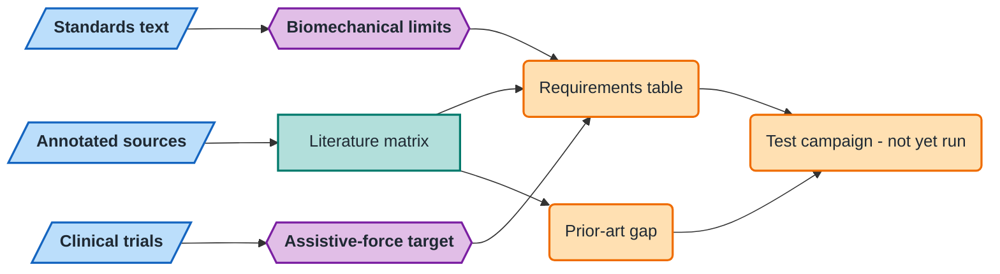

# Soft Robotic Assistant for Physical Interaction with Elderly and Rehabilitation Patients

**Literature evidence base and derived design requirements for a compliant
upper-body assistive robot — a torso and two arms that a person can lean on,
push, or be guided by.**

[](https://github.com/500ft/Soft-Robotic-Assistant-for-Physical-Interaction-with-Elderly-and-Rehabilitation-Patients/actions/workflows/ci.yml)
[](https://www.python.org/)
[](literature/literature_matrix.csv)
[](literature/refs.bib)

**[Requirements](docs/requirements.md) · [Prior art](docs/prior-art.md) · [Evidence limits](docs/evidence-limits.md) · [Next steps](NEXT_STEPS.md) · [Reproduce](#reproduce-the-checks)**

## Overview

This repository holds the evidence layer for a senior design project: a
freestanding compliant upper body that delivers measurable assistive force to
elderly and rehabilitation patients while remaining safe under uncontrolled
physical contact.

It contains no hardware, no simulation, and no measurements. What it contains is
205 annotated sources organized by the design decision each one informs, a
requirements table in which every number is either cited or explicitly marked
inferred, a prior-art table, and a written record of what the literature does
**not** support.

Three findings changed the shape of the project and are documented in full:

- **The impact-compliance safety argument does not hold as usually stated.**
  Intrinsic joint elasticity does not reduce HIC or peak impact force relative to
  conventional actuation with some joint elasticity, and stored spring energy can
  make compliant actuation worse. Free-flight impact from a low-speed arm is
  already survivable. The dominant hazard for a torso a person leans on is
  quasi-static clamping, where inertia stops mattering. Four sections reach this
  independently. See [docs/requirements.md](docs/requirements.md#the-safety-argument-that-survives).
- **A freestanding soft humanoid upper body is not unoccupied ground.** HuggieBot
  2.0/3.0, King Louie and Niiyama's inflatable hugging robot already occupy it,
  one of them with 48 human subjects in uncontrolled full-body contact. The claim
  that survives is narrower and better. See [docs/prior-art.md](docs/prior-art.md).
- **The clinically argued assistive-force target is 28 N, not the tens of newton-metres
  the brief implies.** That is low enough to change which actuator families remain
  viable. See [docs/requirements.md](docs/requirements.md).
- **A patent search found the same hole the papers did.** Freestanding patient-handling
  patents are uniformly rigid; compliant patents are uniformly wearable. Nothing occupies
  the intersection. Two independent searches, one gap. See [G1.md](literature/sections/G1.md).



*Shapes: parallelogram = input · rectangle = process · hexagon = core method · rounded = result.*

## Evidence boundary

Read this before quoting any number from this repository.

Nothing here is measured. Every value is transcribed from a published source, and
every source carries an evidence grade, a verification note naming the URL that was
actually fetched, and a limitations field. Where a source could not be read in full,
the numeric fields say so rather than carrying a plausible figure.

Two specific cautions, both expanded in [docs/evidence-limits.md](docs/evidence-limits.md):

- **Two requirement cells are arithmetic, not citations.** Shoulder and elbow
  gravity-compensation torque depend on assumed centre-of-mass moment arms that no
  source supplies. They are marked `INFERRED` in the requirements table and must be
  measured before the spec is frozen.
- **The governing standard publishes no numbers.** IEC 80601-2-78 hands personal care
  robots to ISO 13482; ISO 13482 publishes no contact limits; ISO/TS 15066 states it
  does not apply to non-industrial robots. The limits used here are imported under a
  documented ISO 14971 argument. That is an argument, not a compliance claim, and the
  final report must present it as one.

## Sources by design decision

Each section answers one question the team has to defend in a design review.

| | Decision | Section | Sources |
|---|---|---|---|
| A1 | Can soft actuation reach the force target? | [A1.md](literature/sections/A1.md) | 15 |
| A2 | Series elastic and variable stiffness as the fallback | [A2.md](literature/sections/A2.md) | 15 |
| A3 | Are pneumatic artificial muscles worth the supply cost? | [A3.md](literature/sections/A3.md) | 15 |
| B1 | Where does the load path go when a patient leans? | [B1.md](literature/sections/B1.md) | 14 |
| B2 | How does the robot know it is touching someone? | [B2.md](literature/sections/B2.md) | 14 |
| C1 | What number must the test campaign beat? | [C1.md](literature/sections/C1.md) | 16 |
| C2 | How is contact safety actually measured, on what rig? | [C2.md](literature/sections/C2.md) | 19 |
| D1 | What control architecture delivers force through a compliant plant? | [D1.md](literature/sections/D1.md) | 14 |
| E1 | What assistive force is clinically meaningful? | [E1.md](literature/sections/E1.md) | 16 |
| E2 | How is perceived approachability measured defensibly? | [E2.md](literature/sections/E2.md) | 16 |
| F1 | What already exists, and where is the real gap? | [F1.md](literature/sections/F1.md) | 15 |
| G1 | What is patented, and what does it block? | [G1.md](literature/sections/G1.md) | 8 |
| G2 | Caregiving-contact and soft-rehab papers | [G2.md](literature/sections/G2.md) | 21 |
| G3 | Standards status and the regulatory path | [G3.md](literature/sections/G3.md) | 7 |

Every entry records citation, DOI or URL with the verification route, open-access
status, contribution, hard numbers, design relevance, evidence grade, and limitations.
Each section closes with a verdict and a list of adjacent topics it did not cover.

## Reproduce the checks

No third-party dependencies; the standard library is enough.

```bash
python analysis/build_literature_matrix.py     # regenerate literature_matrix.csv
python -m unittest discover -s analysis/tests -v
python analysis/check_literature_coverage.py
```

`literature_matrix.csv` is a derived artifact. The coverage check regenerates it in
memory and fails if the committed copy has drifted, so the matrix cannot fall out of
step with the annotated sections. It also fails on a source missing any required
field, a source with no resolvable DOI or URL, a duplicate bibliography key, or a
section file not linked from this README.

## Layout

```
docs/
  requirements.md        derived spec, every cell sourced or marked INFERRED
  prior-art.md           comparable systems and the defensible novelty claim
  evidence-limits.md     verification notes, citation traps, do-not-quote list
literature/
  sections/*.md          annotated bibliography, one file per design decision
  literature_matrix.csv  derived index of all 169 annotated sources
  refs.bib               238 deduplicated BibTeX entries
  _provenance/           per-section BibTeX, search outline, extraction schema
analysis/
  build_literature_matrix.py
  check_literature_coverage.py
  tests/
```

## Method

Eleven independent literature agents ran in parallel, one per decision area, each
required to run at least six distinct searches and to verify every citation by
fetching a record that shows it — Crossref, OpenAlex, Semantic Scholar, PMC, arXiv,
or the publisher page. Agents were instructed that an unverified plausible citation
is worse than returning fewer sources, and that a manufactured novelty claim is the
worst available outcome.

That instruction caught real errors, which are recorded in
[docs/evidence-limits.md](docs/evidence-limits.md) rather than quietly fixed: a
fabricated author attribution traced back to the correct paper through a raw HTML
bibliography, two miscited author orders, a widely circulated torque figure that
exists in no retrievable source, and one case where fetching a paper showed it did
not make the argument a search summary attributed to it.

A second pass (sections G1–G3) verified an externally supplied prior-art list covering
patents, caregiving-contact papers and standards status. **52 items checked, none
fabricated, 14 carrying metadata errors** — two patents with the wrong assignee (Google
Patents is wrong on both; the originals were pulled from CNIPA), one paper attributed to
the wrong first author, one "title" that belongs to no paper, and one latency figure that
described something other than what it was cited for. Every correction is recorded in
[docs/evidence-limits.md](docs/evidence-limits.md).

The search outline and the extraction schema each agent worked to are in
[literature/_provenance/](literature/_provenance/).

## License

[MIT](LICENSE).
